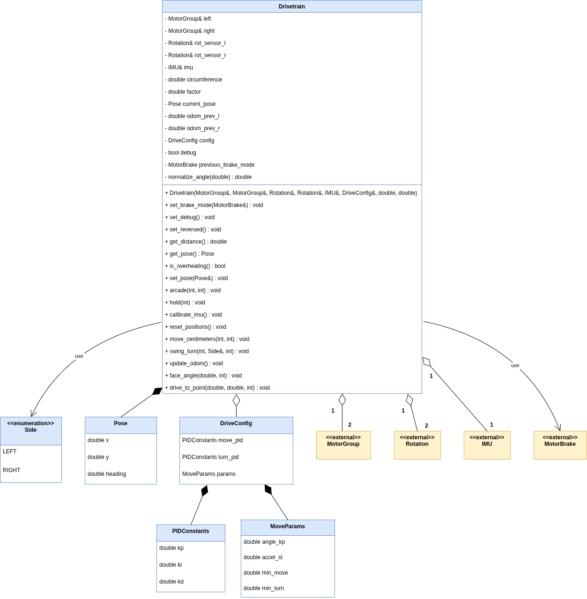

# VortexLib

PROS library for chassis control and odometry of our robot.

## Installation

Fetch and apply the library using the PROS CLI:

```bash
pros c fetch https://github.com/Raumx7/VortexLib/releases/download/v0.1.0/vortexlib@0.1.0.zip
pros c apply vortexlib
```

Then include the header in your project:

```cpp
#include "vortexlib/drivetrain.h"
```

---

## Drivetrain class



### Constructor

The `Drivetrain` constructor takes references to all hardware objects and a `DriveConfig` struct containing every tunable parameter. No sensor initialization happens here — sensors must be declared globally before being passed in.

```cpp
vortex::Drivetrain chasis(m_left, m_right, rot_l, rot_r, imu, configs, 8.25, (60.0 / 36.0));
```

| Parameter | Type | Description |
|---|---|---|
| `left_motors` | `pros::MotorGroup&` | Left drive motor group |
| `right_motors` | `pros::MotorGroup&` | Right drive motor group |
| `left_rotation` | `pros::Rotation&` | Left tracking encoder |
| `right_rotation` | `pros::Rotation&` | Right tracking encoder |
| `imu_sensor` | `pros::IMU&` | Inertial sensor |
| `config` | `const DriveConfig&` | PID constants and motion parameters |
| `wheel_diameter` | `double` | Wheel diameter in centimeters |
| `gear_ratio` | `double` | `motor_teeth / wheel_teeth` — defaults to `1.0` |

---

### DriveConfig

`DriveConfig` groups all tunable values into one struct so they stay in `main.cpp` and never require touching the library source. It contains two `PIDConstants` structs and one `MoveParams` struct.

```cpp
vortex::DriveConfig configs {

    {.kp = 2.5, .ki = 0.0, .kd = 0.08},  // move_pid
    {.kp = 1.5, .ki = 0.0, .kd = 0.90},  // turn_pid

    {
        .angle_kp = 9.0,    // move heading correction
        .accel_st = 7.0,    // move acceleration step
        .min_move = 30.0,   // min. move output
        .min_turn = 15.0    // min. turn output
    }

};
```

#### PIDConstants

Used for both `move_pid` and `turn_pid`.

| Field | Type | Description |
|---|---|---|
| `kp` | `double` | Proportional gain — primary correction force |
| `ki` | `double` | Integral gain — corrects steady-state error; keep `0.0` until `kp` and `kd` are tuned |
| `kd` | `double` | Derivative gain — dampens overshoot; acts as a predictive brake |

#### MoveParams

| Field | Type | Affects | Description |
|---|---|---|---|
| `angle_kp` | `double` | `move_centimeters` | Heading correction strength — how hard the robot steers to stay straight |
| `accel_st` | `double` | `move_centimeters` | Motor output added per 20 ms cycle during ramp-up; deceleration uses `2.5×` this value |
| `min_move` | `double` | `move_centimeters` | Minimum output to overcome drivetrain static friction during fine approach |
| `min_turn` | `double` | `face_angle`, `swing_turn` | Minimum output to overcome static friction during turning |

---

### Tuning guide

All constants are tuned on the physical robot, in the order below. **Never change two constants at the same time** — it makes it impossible to know which one caused the change.

#### Step 1 — `min_turn` (first, before any PID)

`min_turn` is the minimum motor output needed to overcome static friction during a turn. Set it wrong and no amount of PID tuning will fix stalling or overshoot.

Run `face_angle(90)` with `kp = 1.5`, `ki = 0`, `kd = 0` and watch where the robot stops:

| Observation | Action |
|---|---|
| Stops several degrees short, output in log is low (~5–10) | `min_turn` is too low — raise by 5 |
| Reaches target but immediately oscillates past it | `min_turn` is too high — lower by 3 |
| Reaches < 1° and holds | `min_turn` is correct — move to Step 2 |

> Your chasis settled at **`min_turn = 15.0`**.

#### Step 2 — `turn_pid.kp`

With `min_turn` set, raise `kp` until the robot arrives at the target without oscillating. Start at `1.5` and increase by `0.2` each run.

| Observation | Action |
|---|---|
| Robot arrives slowly, takes > 2 s for 90° | Raise `kp` by `0.2` |
| Robot overshoots and oscillates 1–2 times | Lower `kp` by `0.1` |
| Robot arrives cleanly in < 2 s | `kp` is correct — move to Step 3 |

#### Step 3 — `turn_pid.kd`

`kd` is the brake. Raise it until overshoot disappears at full speed (`max_vel = 127`).

| Observation | Action |
|---|---|
| Robot overshoots at high speed | Raise `kd` by `0.1` |
| Robot slows down too early, creeps to target | Lower `kd` by `0.1` |
| Robot arrives cleanly at any speed | `kd` is correct |

#### Step 4 — `turn_pid.ki` (only if needed)

Add `ki` only if the robot consistently stops 1–2° short after Steps 1–3 are tuned.

| Observation | Action |
|---|---|
| Residual error of 1–2° every run | Set `ki = 0.02`, retest |
| Robot oscillates slowly after adding `ki` | Lower `ki` by half |
| No residual error without `ki` | Leave `ki = 0.0` |

#### Step 5 — `min_move`

Same principle as `min_turn` but for `move_centimeters`. Run `move_centimeters(60)` and measure the actual distance with a tape:

| Observation | Action |
|---|---|
| Stops 3–5 cm short, speed in log drops to near zero | Raise `min_move` by 5 |
| Overshoots consistently | Lower `min_move` by 3 or check `DECEL_STEP` |
| Lands within 1–2 cm | `min_move` is correct |

#### Step 6 — `move_pid.kp` and `move_pid.kd`

Follow the same logic as Steps 2–3 but for distance. Run at `max_vel = 80` first, then `127`.

| Observation | Action |
|---|---|
| Overshoots at high speed | Lower `kp` or raise `kd` |
| Stops short consistently even with correct `min_move` | Raise `kp` by `0.3` |
| Brakes abruptly and bounces near the target | Lower `kd` by half |

#### Step 7 — `accel_st`

Controls how fast the robot ramps up. Tune last, after distance accuracy is acceptable.

| Observation | Action |
|---|---|
| Wheels slip or skip at start | Lower `accel_st` from `7.0` → `5.0` |
| Ramp-up feels sluggish | Raise `accel_st` from `7.0` → `10.0` |

#### Step 8 — `angle_kp`

Run `move_centimeters(120)` on a straight line and observe the path from above.

| Observation | Action |
|---|---|
| Robot drifts consistently left or right | Raise `angle_kp` by `2.0` |
| Robot serpentines (left-right-left) | Lower `angle_kp` by `2.0` |
| Robot tracks straight | `angle_kp` is correct |

---

### Setup

Declare all hardware objects globally, then create the `Drivetrain` instance. Start the odometry task in `initialize()`.

```cpp
#include "main.h"
#include "vortexlib/drivetrain.h"

pros::MotorGroup m_left({-1, -12, 11});
pros::MotorGroup m_right({10, -15, 18});
pros::IMU        imu(16);
pros::Rotation   rot_l(13);
pros::Rotation   rot_r(19);

vortex::DriveConfig configs {

    {.kp = 2.5, .ki = 0.0, .kd = 0.08},  // move_pid
    {.kp = 1.5, .ki = 0.0, .kd = 0.90},  // turn_pid

    {
        .angle_kp = 9.0,
        .accel_st = 7.0,
        .min_move = 30.0,
        .min_turn = 15.0
    }

};

vortex::Drivetrain chasis(m_left, m_right, rot_l, rot_r, imu, configs, 8.25, (60.0 / 36.0));

void initialize() {
    chasis.calibrate_imu();
    chasis.reset_positions();

    pros::Task odom_task([](void* param) {
        auto* c = static_cast<vortex::Drivetrain*>(param);
        while (true) { c->update_odom(); pros::delay(10); }
    }, &chasis, "odom");
}
```

---

## Methods

### Configuration

---

#### `set_brake_mode()`

Sets the brake mode for both motor groups simultaneously. Also updates the internal previous_brake_mode so that subsequent hold(duration_ms) calls restore to this mode correctly. Call this at the start of opcontrol() to establish the driver-control baseline.

```cpp
chasis.set_brake_mode(pros::MotorBrake::coast);
```

| Parameter | Type | Description |
|---|---|---|
| `mode` | `const pros::MotorBrake&` | `coast`, `brake`, or `hold` |

---

#### `set_reversed()`

Reverses both tracking encoders in software. Call this in `initialize()` if forward motion produces negative encoder readings due to physical mounting orientation.

```cpp
chasis.set_reversed();
```

---

#### `set_debug()`

Activates the debug flag. When enabled, motion methods (`face_angle()`,
`move_centimeters()`, `swing_turn()`) print PID internals to the console
every cycle — useful for reading live telemetry with `pros terminal` during tuning.

Call once in `initialize()` or before the routine under test. Disable by
removing the call and re-flashing.

```cpp
void initialize() {
    chasis.set_debug();   // enable console output
    chasis.calibrate_imu();
    ...
}
```

> Output format varies per method. Example from `face_angle()`:
> ```
> heading: 87.45 | error: 2.55 | integral: 0.00 | deriv: -0.60 | out: 20.00
> ```
---
### Telemetry

---

#### `get_distance()`

Returns the signed average displacement of both tracking encoders since the last `reset_positions()` call, in centimeters. Forward motion returns a positive value; reverse returns negative.

```cpp
double dist = chasis.get_distance();
```

---

#### `get_pose()`

Returns a snapshot of the current odometry position.

```cpp
vortex::Pose pose = chasis.get_pose();
// pose.x       → cm East from origin
// pose.y       → cm North from origin
// pose.heading → degrees [0, 360), 0° = North
```

---

#### `set_pose()`

Forces the odometry position to a known value. Call at the start of each autonomous routine to define the field origin relative to the robot's starting tile.

```cpp
chasis.set_pose({.x = 0.0, .y = 0.0, .heading = 0.0});
```

| Parameter | Type | Description |
|---|---|---|
| `pose` | `const Pose&` | Target position `{x, y, heading}` |

---

#### `is_overheating()`

Returns `true` if any motor in either group exceeds 55 °C. Useful for displaying a warning on the controller during long matches.

```cpp
if (chasis.is_overheating()) {
    master.set_text(2, 0, "! TEMP HIGH !");
}
```

---

### Driver Control

---

#### `arcade()`

Maps joystick axes to differential drive with a linear response. A ±5 deadband on both axes prevents motor chatter from stick drift.

```cpp
void opcontrol() {
    while (true) {
        int fwd  = master.get_analog(pros::E_CONTROLLER_ANALOG_LEFT_Y);
        int turn = master.get_analog(pros::E_CONTROLLER_ANALOG_RIGHT_X);
        chasis.arcade(fwd, turn);
        pros::delay(20);
    }
}
```

| Parameter | Type | Description |
|---|---|---|
| `forward` | `int` | Left stick Y axis `[-127, 127]` |
| `turn` | `int` | Right stick X axis `[-127, 127]` |

---

#### `hold()`

Applies active HOLD braking to both motor groups. Applies HOLD to both motor groups, then restores previous_brake_mode after `duration_ms`. The restored mode is whatever was last set by set_brake_mode() — not sampled at the moment of the call if a duration is provided.

```cpp
chasis.hold();        // hold indefinitely (autonomous)
chasis.hold(150);     // hold for 150 ms, then restore previous mode (driver control)
```

| Parameter | Type | Default | Description |
|---|---|---|---|
| `duration_ms` | `int` | `0` | Hold duration in milliseconds; `0` holds indefinitely |

---

### Autonomous — Primitives

---

#### `calibrate_imu()`

Resets the IMU and waits up to 2 seconds for calibration to complete. Must be called before any method that reads heading. Call in `initialize()`.

```cpp
void initialize() {
    chasis.calibrate_imu();
}
```

---

#### `reset_positions()`

Zeroes both tracking encoder positions. Call before a routine that needs fresh relative distance tracking, or use the `start_dist` snapshot pattern inside `move_centimeters()` to avoid resetting shared state.

```cpp
chasis.reset_positions();
```

---

#### `move_centimeters()`

Drives a signed distance in centimeters along the heading held at the moment of the call. Positive values move forward; negative values move in reverse.

Uses a PID controller with an asymmetric slew rate (deceleration at 2.5× `accel_st`) and a heading correction term to keep the robot straight. Exits when position error is within 1 cm and remains there for 120 ms, or the 5-second timeout elapses.

```cpp
chasis.move_centimeters(60);         // drive 60 cm forward at full speed
chasis.move_centimeters(-30, 80);    // drive 30 cm in reverse at 80/127 speed
```

| Parameter | Type | Default | Description |
|---|---|---|---|
| `target_cm` | `int` | — | Target displacement in centimeters (signed) |
| `max_vel` | `int` | `127` | Maximum motor output `[0, 127]` |

---

#### `swing_turn()`

Pivots the chassis around one stationary wheel. The pivot side is set to HOLD and braked; the active side drives with the `turn_pid` controller and `min_turn` friction compensation. Useful for aligning to field walls without lateral drift.

> The pivot axis has more friction than a center turn. If the robot stalls during a swing, try multiplying `min_turn` by `1.2` for swing-only moves.

```cpp
chasis.swing_turn(45, vortex::Side::RIGHT, 70);   // pivot right 45°
chasis.swing_turn(-30, vortex::Side::LEFT);        // pivot left -30° at default speed
```

| Parameter | Type | Default | Description |
|---|---|---|---|
| `degrees` | `int` | — | Rotation in degrees (signed) |
| `side` | `const Side&` | — | `Side::LEFT` or `Side::RIGHT` — the wheel that stays fixed |
| `max_vel` | `int` | `80` | Maximum motor output for the active side |

---

### Odometry

---

#### `update_odom()`

Integrates encoder deltas and IMU heading into the `(x, y, heading)` pose using an arc model with averaged heading to reduce integration error on curved paths. Must run in a background task every ~10 ms — it is not called automatically.

```cpp
pros::Task odom_task([](void* param) {
    auto* c = static_cast<vortex::Drivetrain*>(param);
    while (true) {
        c->update_odom();
        pros::delay(10);
    }
}, &chasis, "odom");
```

Field convention: **North = +Y, East = +X**, heading 0° = North — consistent with `imu.get_heading()`.

---

### Autonomous — High Level

---

#### `face_angle()`

Rotates to an absolute field heading using a PID controller. Always takes the shortest path (normalized to `[-180°, 180°]`). Includes integral windup mitigation and friction compensation via `min_turn`. Exits when error stays within 1° for 120 ms, or the 3-second timeout elapses.

```cpp
chasis.face_angle(0);          // face North
chasis.face_angle(90, 100);    // face East at speed 100
chasis.face_angle(180);        // face South
```

| Parameter | Type | Default | Description |
|---|---|---|---|
| `target_heading` | `double` | — | Absolute field heading in degrees `[0, 360)` |
| `max_vel` | `int` | `80` | Maximum motor output |

---

#### `drive_to_point()`

Moves the robot to a field coordinate `(x, y)` in two phases: rotate to face the target with `face_angle()`, then drive the Euclidean distance with `move_centimeters()`. Automatically drives in reverse if the required turn exceeds 90°.

Requires `update_odom()` running in the background. Call `set_pose()` before the autonomous routine to establish the correct origin.

```cpp
chasis.set_pose({.x = 0.0, .y = 0.0, .heading = 0.0});

chasis.drive_to_point(60.0, 90.0);         // go to (60, 90) at full speed
chasis.drive_to_point(-30.0, 45.0, 90);    // go to (-30, 45) at speed 90
```

| Parameter | Type | Default | Description |
|---|---|---|---|
| `x` | `double` | — | Target X coordinate in centimeters (East) |
| `y` | `double` | — | Target Y coordinate in centimeters (North) |
| `max_vel` | `int` | `127` | Maximum motor output |

---

## Field Coordinate System

```
         0° (North) +Y
              ↑
              │
 270° ────────┼──────── 90° (East) +X
 (West)       │
              ↓
           180° (South)
```

`set_pose()` and `drive_to_point()` use this convention. The IMU returns `0°` when facing the direction calibrated as North at startup.